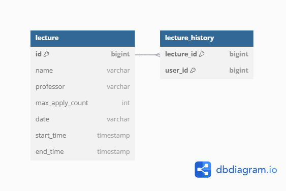
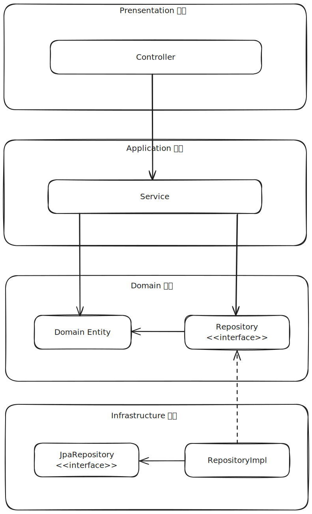

# 클린 아키텍쳐


## 서비스 정책 분석

---
- **특강 신청**
  - **유저ID**로 특강 신청 가능
  - 유저는 동일 특강에 대해 한번의 수강 신청만 성공 가능
  - 특강은 선착순 30명만 신청 가능 -> **30명이 신청된 이후의 요청은 실패**


- **특강 신청 가능 목록 조회**
  - **유저ID**와 **날짜**로 목록 조회 가능
  - **아래 3가지 조건을 전부 만족한 강의만 조회 가능**
    - 현재 강의 신청 인원이 30명 미만
    - 아직 시작하지 않은 강의
    - 조회 요청한 유저가 신청하지 않은 강의


- **특강 신청 완료 목록 조회**
    - **유저ID**로 조회 가능


## ERD

---


### lecture 테이블
강의 정보 테이블
  - **id**: Primary Key
  - name: 이름
  - professor: 강사명
  - max_apply_count: 최대 수강 인원
  - **date**: "2024-01-01" 포맷의 강의 날짜 문자열 **(Btree Index)**
  - start_time: 강의 시작 시간
  - end_time: 강의 종료 시간  
```
특강 신청과 같은 일정 예약 서비스는 조회 트래픽이 많이 발생할 가능성이 높습니다.  
특강 검색 조건이 날짜이기에 date 컬럼에 인덱스를 추가하여 조회 성능을 높이고자 하였습니다.
```

### lecture_history
유저의 특강 신청 정보 테이블
- `lecture_id, user_id` 복합키로 특강 신청 이력 유일성 보장


## Architecture

---

```
src.main.java.com.exmple.hhplus 
   ├─lecture         
   │  ├─application  <- 애플리케이션 계층
   │  │  ├─dto       
   │  │  └─exception <- 애플리케이션 예외 
   │  ├─domain       <- 도메인 패키지
   │  │  └─exception <- 도메인 예외
   │  ├─infrastructure <- 인프라 계층
   │  └─presentation <- 프레젠테이션(진입) 계층
   │      └─dto
   └─lecturehistory
       ├─domain
       └─infrastructure
```


저는 JpaRepository를 그대로 사용하지 않고 DIP를 적용하였습니다.  
이유는 아래와 같습니다.

- JpaRepository를 직접 사용하면 JPA의 메서드 시그니처를 그대로 사용하게 됩니다.
- 사실상 JPA의 구현체를 사용하듯이 개발하게 되며, 이는 캐시와 같은 영속성 정책이 추가되면 service 계층의 변경이 필요하다는 의미입니다.

저는 JPA의 메서드 시그니처를 그대로 사용하기보다는 다른 영속성 솔루션에서도 사용할 수 있게 좀 더 보편적인 메서드 시그니처를 사용하고자 하였습니다.


## 동시성 제어 방법

---

### 40명이 신청했을 때 30명 이상 신청이 들어오지 않아야 함
아래와 같이 `Exclusive Lock`을 이용하여 다른 트랜잭션의 Read/Write를 차단하였습니다.  
이렇게 하여 특강 신청 이력이 30개를 초과하지 않도록 제어하였습니다.
```java
@Lock(LockModeType.PESSIMISTIC_WRITE)
@Query("SELECT l FROM Lecture l WHERE l.id = :id")
Optional<Lecture> findByIdForUpdate(@Param("id") long id);
```

### 같은 유저가 동일한 특강에 신청하지 못하도록 개선
테이블에서 `user_id`, `lecture_id`를 PK로 두어 DB 수준에서 무결성을 보장하였습니다.
